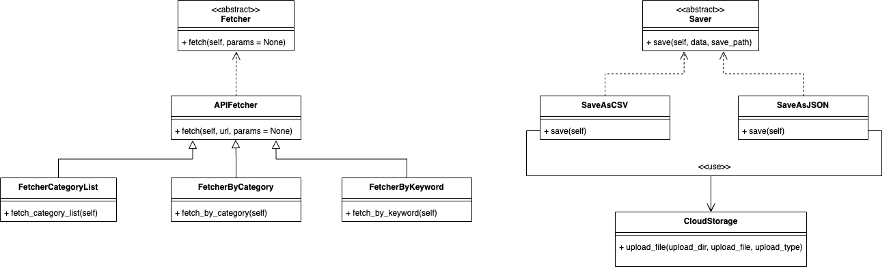

# Project 1 - Tiki Crawling Application - quangtt

Tiki Crawling Application is a simple to crawl product list from Tiki website (by Category and Keyword).

## Setup

Use the package manager [pip](https://pip.pypa.io/en/stable/) to install Tiki Crawling App.

```bash
pip install -r requirements.txt
```

## Technologies
Project is created with:
* Python: 3.10.10
* Flask: 2.2.3
* Bootstrap: 5.3.0
* google: 3.0.0
* google-cloud-storage: 2.8.0

## Folder Structure

```
├── README.md
├── app
│   ├── __init__.py
│   ├── const
│   │   ├── CONST.py
│   │   
│   ├── services
│   │   ├── cloud_storage
│   │   │   └── cloud_storage.py
│   │   ├── fetcher
│   │   │   ├── api_fetcher
│   │   │   │   ├── api_fetcher.py
│   │   │   │   ├── fetcher_by_category.py
│   │   │   │   ├── fetcher_by_keyword.py
│   │   │   │   └── fetcher_category_list.py
│   │   │   └── fetcher.py
│   │   └── saver
│   │       ├── saver.py
│   │       ├── saver_as_csv.py
│   │       └── saver_as_json.py
│   ├── setup
│   │   └── fresher-training-02-9bba1703c510.json
│   ├── static
│   │   └── css
│   │       └── style.css
│   ├── templates
│   │   └── public
│   │       ├── error.html
│   │       ├── index.html
│   │       ├── preview.html
│   │       ├── save_data.html
│   │       └── templates
│   │           └── public_template.html
│   └── views
│       ├── home.py
│       ├── invalid_route.py
│       ├── preview.py
│       └── result.py
├── package.json
├── requirements.txt
├── run.py
```

## UML Diagram



## Contributing

quangtt@athena.studio
